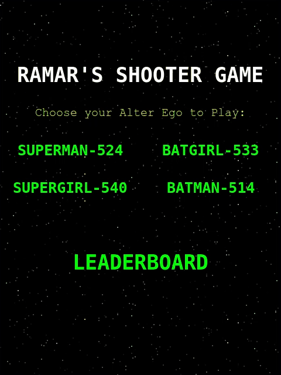
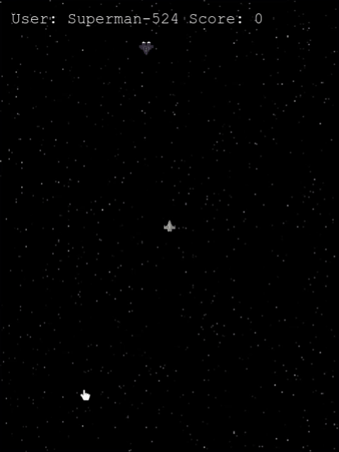
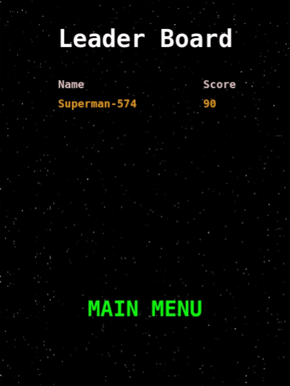

# Space Shooter

A Space shooter game running on Phaser 3, that implements ands coring system with leaderboards

## Game Play

- Start game by selecting an alter ego.
  
- You need to survive a wave of enemy ships by using arrow keys for direction.
- You can destroy enemy ships by shooting lasers using the `Spacebar`.
  
- If you colide with the enemy ship or you are hit by any of their lasers, it game over.
- Every enemy ship you hit scores you 10 points.
- Watch out for the enmy ships that follow you! PLay and see how high you performed agians others' alter egos on the leaderboard
  
- The leaderboard shows a maximum of 10 of the latest scores sorted from the highest.

## Built With

- Javscript, HTML/CSS,
- Phaser 3,
- webpack

## Live Demo

[Live Demo Link](https://raheebwa.github.io/mv-shooter-game)

## Getting Started

To get a local copy up and running follow these simple example steps.

### Prerequisites

- NPM / NodeJS
- YARN

### Setup

- To run locally, Clone repo and at the root of application run `npm or yarn install`

### Usage

- Execute `yarn webpack` at root of application to build game.
- Execute `yarn server` at root of application and open broswer at `localhost:9000` to play.

## Authors

👤 **Aheebwa Ramadhan**

- Github: [@raheebwa](https://github.com/raheebwa)
- Twitter: [@raheebwa](https://twitter.com/raheebwa)
- raheebwa: [raheebwa](https://raheebwa.com/aheebwaramadhan)

## 🤝 Contributing

Contributions, issues and feature requests are welcome!

Feel free to check the [issues page](issues/).

## Show your support

Give a ⭐️ if you like this project!

## 📝 License

This project is [MIT](lic.url) licensed.
